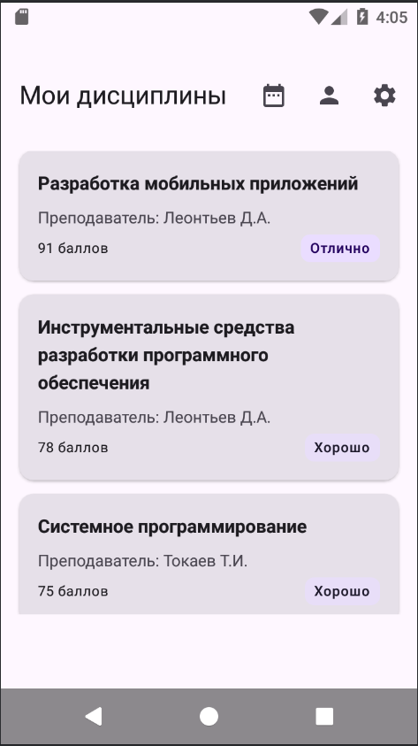
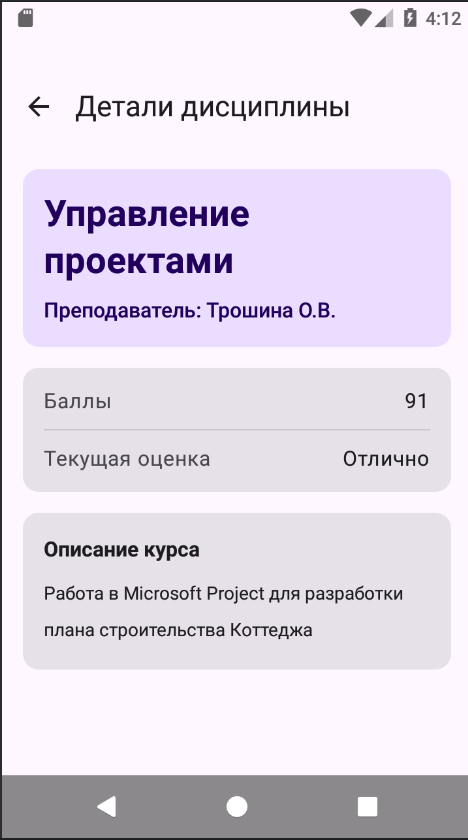
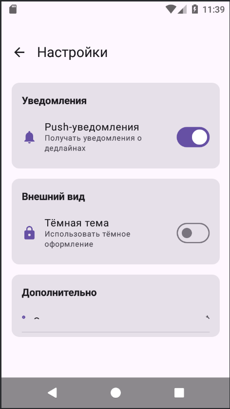
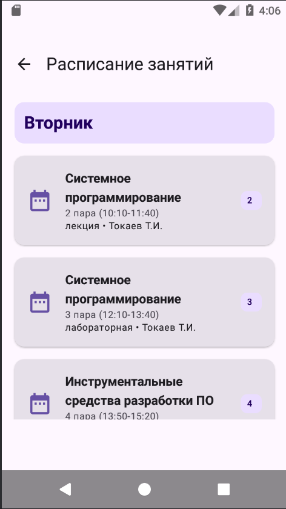
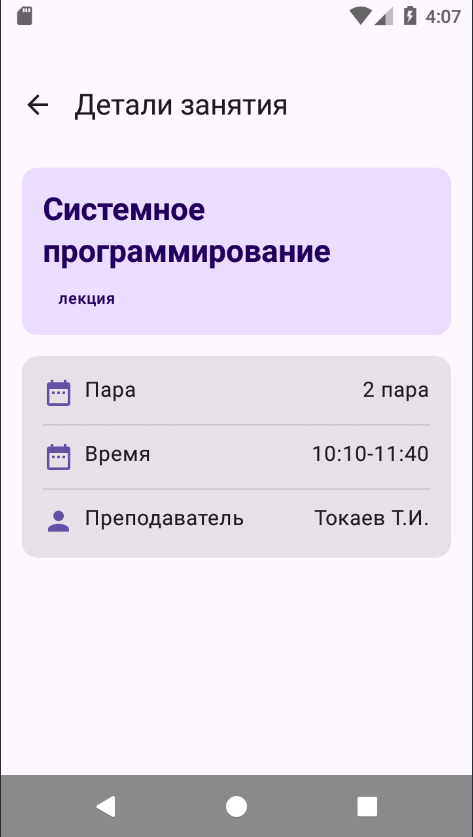

# Лабораторная работа №15-16. Navigation in Jetpack Compose

ФИО: Федотова В.С.
Группа: ИСП-232
Дата: 23.03.26

---

## Описание

Приложение "Студенческий планер" разработано для организации учебного процесса студента.
Оно позволяет просматривать список изучаемых дисциплин с подробной информацией о каждой,
включая преподавателя, количество баллов и текущую оценку.

## Реализованные экраны

- Главная страница со списком дисциплин
- Детали дисциплины
- Профиль студента
- Настройки
- Расписание на неделю
- Детали занятия

## Используемые технологии

- Kotlin
- Jetpack Compose
- Navigation Compose

## Схема навигации между экарнами

1. При открытии приложения пользователю показывается главный экран
2. При нажатии на одну из дисциплин на главном экране пользователя перебрасывает на экарн с деталями
3. На главном экране при нажатии на иконку человечка пользователя перебрасывает на экран профиля студента
4. На главном экарне при нажатии на иконку шестерни пользователя перебрасывает на экран настроек
5. Каждый открытый экран имеет кнопку Назад, которая вернёт их на главный экран

## Скриншоты








## Контрольные вопросы

### Что такое NavController и для чего он используется?

- Объясните своими словами роль NavController в навигации: NavController управляет навигацией в приложении и возможностью вернуться назад по маршруту

- Почему важно создавать его через rememberNavController()?: Потому что remember сохраняет NavController при рекомпозиции, т.е. при ней не теряются данные

### Как передать параметр в маршрут навигации?

- Опишите процесс: от определения маршрута до извлечения параметра:
  - Определение маршрута с параметром - в sealed class создается маршрут с placeholder в фигурных скобках.
  - Регистрация в NavHost - при добавлении composable указывается список аргументов через navArgument(), где задается тип и имя параметра.
  - Переход на экран с параметром - при вызове navController.navigate() в строку маршрута подставляется конкретное значение.
  - Извлечение параметра — внутри composable параметр извлекается из backStackEntry.arguments?.getString("subjectId") и передается в экран для дальнейшего использования.

- В чём разница между обязательными и опциональными параметрами?: Обязательные параметры всегда должны присутствовать в строке маршрута, тогда как опциональные могут иметь значение по умолчанию и передаваться через запрос

### Зачем использовать sealed class для маршрутов?

Какие преимущества даёт sealed class по сравнению с обычными
строками?: Sealed class гарантирует, что компилятор знает о всех возможных вариантах маршрутов.

Приведите пример ошибки, которую sealed class помогает избежать: использование строки "profle" вместо "profile" не будет скомпилировано, если обращаться к объекту Screen.Profile.route, что помогает избежать ошибок с опечатками в строках.

### Что такое Back Stack и как им управлять?

Back Stack (стек возврата) - это механизм, который хранит историю переходов пользователя между экранами приложения. Он работает по принципу LIFO (Last In - First Out, последним пришёл - первым ушёл).

Нарисуйте схему back stack для последовательности: Home → Profile
→ Settings:
```
┌──────────┐
│ Settings │ ← текущий экран (последний добавленный)
├──────────┤
│ Profile  │
├──────────┤
│   Home   │ ← начальный экран
└──────────┘
```

Что произойдёт при вызове popBackStack() на экране Settings?: экран Settings уберётся из стека

### Как работает startDestination в NavHost?

Какой экран будет показан первым при запуске приложения?: тот экран который мы передали для startDestination, чаще всего Home

Можно ли изменить startDestination динамически?: Можно изменить определением перед созданием NavHost, перенаправлением после загрузки, использованием состояния.

### Что произойдёт, если навигировать на несуществующий маршрут?

Как NavController обрабатывает неизвестные маршруты?: Выдаёт ошибку, приводя к упаду приложения

Как можно обработать такую ситуацию?: 
- Использовать sealed class 
- Внимательно проверять маршруты при регистрации 
- Использовать вспомогательные функции

### Зачем нужен параметр launchSingleTop в навигации?

launchSingleTop - это параметр навигации, который предотвращает создание дубликатов одного и того же экрана в стеке. Если экран уже находится на вершине стека, повторный переход на него не создаст новый экземпляр.

Приведите пример, когда без него может возникнуть проблема: В приложении есть экран с деталями. Если пользователь быстро кликнет по одному элементу несколько раз, произойдёт следующее:

Без launchSingleTop:
- В стеке окажется несколько одинаковых экранов: Главный, Детали, Детали, Детали 
- Чтобы вернуться на главный экран, нужно нажать кнопку "Назад" 3 раза

С launchSingleTop:
- При повторных кликах новый экран не открывается 
- В стеке остаётся: Главный, Детали 
- Достаточно одного нажатия "Назад"

Как он влияет на back stack?: предотвращает появление дубликатов экранов в стеке.